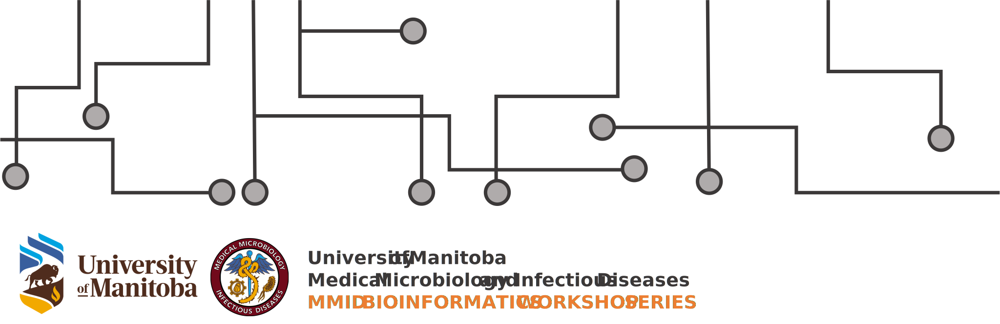

## 2023 MMID Bioinformatics Workshop Operation Committee

### Grace E. Seo (Coordinator / Instructor)
Biologist / Master's student
Enteroviruses and Enteric Viruses Laboratory, Viral Diseases Division, Public Health Agency of Canada 
Microbiology and Infectious Diseases, Rady Faculty of Health Sciences University of Manitoba
Email: grace.seo@phac-aspc.gc.ca / seog@myumanitoba.ca
LinkedIN: www.linkedin.com/in/grace-e-seo
&nbsp; 
##### Background
Grace is a 3rd-year master's student supervised by Drs. Tim Booth and Natalie Knox at the National Microbiology Laboratory (Public Health Agency of Canada). Her research involves optimizing whole-genome sequencing protocol for SARS-CoV-2 using nanopore technology for Canada's COVID-19 genomic surveillance program. She uses various bioinformatics tools on BASH and visualize data in RStudio. In her free time, she likes to try out new technology, building websites, coding random stuff and learn other coding languages such as Java and Python.

---

### Jill Rumore (Co-Coordinator / Instructor)
Biologist / Ph.D. candidate
Surveillance, Outbreak Detection and Response, Division of Enterics, Public Health Agency of Canada
Medical Microbiology and Infectious Diseases, Rady Faculty of Health Sciences, University of Manitoba
Email: jillian.rumore@phac-aspc.gc.ca
&nbsp;
##### Background:
Jill has been a Biologist with the Public Health Agency of Canada since 2014 and is in her 4th year of Ph.D. studies at the University of Manitoba in the Department of Medical Microbiology and Infectious Diseases. She is supervised by Drs. Natalie Knox and Celine Nadon and her research project is focused on developing an end-to-end metagenomics-based pipeline for rapid detection of bacterial foodborne pathogens in foods and clinical specimens. She routinely works in conda to conduct her research and has considerable experience with computer coding languages BASH and R.

---

### Rose Chan (Technology/Webmaster Chair)
Master's Student
Medical Microbiology and Infectious Diseases, Rady Faculty of Health Sciences, University of Manitoba
&nbsp; 
##### Background:
Rose is in her 3rd year Master's program. Rose's research interest are viruses, viral-host interaction, and antiviral strategies. Her current thesis project is about developing aptamer, a nucleic acid-based small molecule, for COVID-19 detection and treatment. She is now working under the supervision of Dr. Darwyn Kobasa at the National Microbiology Laboratory. Outside of the lab, she likes to run tabletop games, play badminton, do cooking and listening to music.

---

## 2023 MMID Bioinformatics Workshop Volunteers

### Taylor Davedow (Instructor)
Ph.D. Student
Medical Microbiology and Infectious Diseases, Rady Faculty of Health Sciences, University of Manitoba

### Emma Rempel (Volunteer - In-person sessions)
Volunteer Date: March 9 and March 30, 2023
Technician
Public Health Agency of Canada

### MacKenzie Wilke (Volunteer - Zoom moderator)
Volunteer Date: March 30 and April 20, 2023
Computational Biologist
Public Health Agency of Canada

&nbsp; 

[Back to home page](https://mmid-bioinformatics-workshop.github.io)
