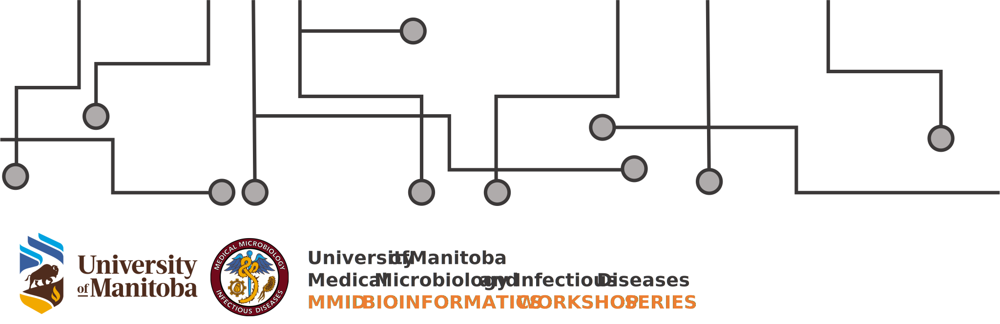
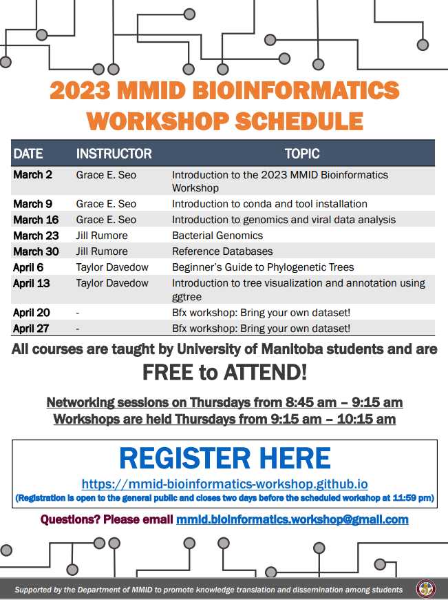

---

# 2023 Workshop details

### Workshop #1) March 2, 2023

| Title |Introduction to the 2023 MMID Bioinformatics Workshop | 
| :--- | :--- |
| Instructor | Grace E. Seo |
| Time | 9:15 AM - 10:15 AM |

**Workshop Information**
*For in-person attendees*
- Setup U of M Wi-Fi connection

*For all attendees*
- Enable WSL (Windows user)
- Install Ubuntu (BASH)
- Install R and RStudio
- Setup GitHub account and provide brief overview on file download
- Provide useful starter guides on BASH and R
- Provide Galaxy Training links

---

### Workshop #2) March 9, 2023

| Title |Introduction to conda and tool installation | 
| :--- | :--- |
| Instructor | Grace E. Seo |
| Time | 9:15 AM - 10:15 AM |

**Workshop Information**
- Overview of conda (concept and purpose explanation)
- Install conda environment 
- Install bioinformatics tools as conda package

---

### Workshop #3) March 16, 2023

| Title | Introduction to Genomics and Viral data analysis | 
| :--- | :--- |
| Instructor | Grace E. Seo |
| Time | 9:15 AM - 10:15 AM |

**Workshop Information**
- Overview of virus genome dataset (note that bacterial genome dataset is next week)
- long read vs. short read sequencing
- Publicly available genome sequence dataset retrieval (GISAID, VirusSeq, NCBI)
- Write a basic script to analyze data using useful bioinformatics tools

---

### Workshop #4) March 23, 2023

| Title | Bacterial Genomics | 
| :--- | :--- |
| Instructor | Jill Rumore |
| Time | 9:15 AM - 10:15 AM |

**Workshop Information**
- workflow from qc to read classification
- overview of commonly used tools (i.e., fastqc, fastp, bowtie2, checkM, Centrifuge, Kraken2, KrakenUniq)
- install conda program (i.e., fastp and/or checkM)
- assess publically available dataset for quality using the installed tool

---

### Workshop #5) March 30, 2023

| Title | Reference databases | 
| :--- | :--- |
| Instructor | Jill Rumore |
| Time | 9:15 AM - 10:15 AM |

**Workshop Information**
- What makes a good reference database?
- Where to find publically available reference databases
- Download publically available reference database
- Perform read classification
- Briefly touch on interpretation (time permitting)

---

### Workshop #6) April 6, 2023

| Title | Beginner's Guide to Phylogenetic Trees | 
| :--- | :--- |
| Instructor | Taylor Davedow |
| Time | 9:15 AM - 10:15 AM |

**Workshop Information**
*Examples of linux based tools (might not be covered)*
- IQtree - maximum likelihood
- mashtree - rapid comparison of WGS (does not infer phylogeny)
- Fasttree - approximate MLT
- phyML - maximum likelihood
- Quicktree - neighbour-joining

*Web-based tools to quickly view output*
- iTol
- Phandango
- Auspice

---

### Workshop #7) April 13, 2023

| Title | Introduction to tree visualization and annotation using ggtree | 
| :--- | :--- |
| Instructor | Taylor Davedow |
| Time | 9:15 AM - 10:15 AM |

**Workshop Information**
- Interactive tree visualization using RStudio

---

### Workshop #8) April 20, 2023

| Title | Bfx workshop: Bring your own dataset! | 
| :--- | :--- |
| Time | 9:15 AM - 10:15 AM |

**Workshop Information**
- Attendees are encouraged to work with each other to analyze their data. Very limited number of volunteers will be available to provide individual guide on data analysis.

---

### Workshop #9) April 27, 2023

| Title | Bfx workshop: Bring your own dataset! | 
| :--- | :--- |
| Time | 9:15 AM - 10:15 AM |

**Workshop Information**
- Attendees are encouraged to work with each other to analyze their data. Very limited number of volunteers will be available to provide individual guide on data analysis.

---

[Back to home page](/index.md)

&nbsp; 
&nbsp; 
© MMID Bioinformatics Workshop 2023